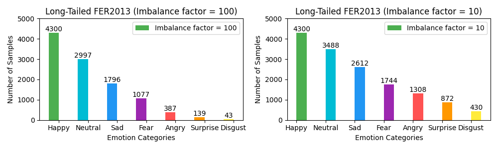
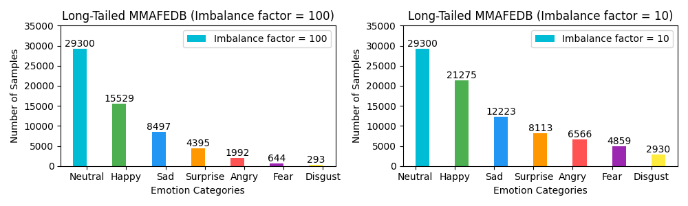
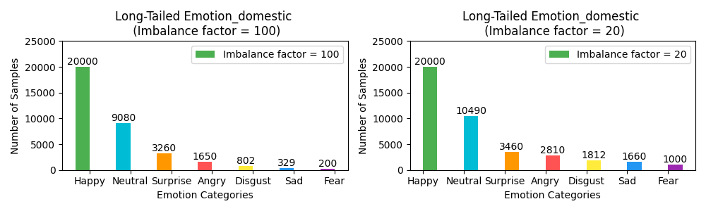

# DICC-Facial-Expression-Recognition
This repository contains scripts for adjusting training set sample counts based on specified imbalance factors, along with pre-processed versions of popular facial expression datasets.

## Scripts Overview

- ​**​`FER2013_imbalance.py`​**​  
  Processes CSV-based datasets (e.g., FER2013). Adjusts training set samples per class according to a user-defined imbalance factor.

- ​**​`emotion_imbalance.py`​**​  
  Processes image-based datasets (e.g., MMAFEDB, Emotion-domestic). Modifies training set sample counts to meet specified imbalance factor.

## Raw Dataset

### FER2013 Dataset
- ​**​Type​**​: CSV file with grayscale pixel arrays  
- ​**​Samples​**​: 35,887 (48×48 px)  
- ​**​Split​**​:
  - Train: 28,709
  - Validation: 3,589
  - Test: 3,589  
- ​**​Classes​**​: 7 emotions (Angry, Disgust, Fear, Happy, Sad, Surprise, Neutral)  

### MMAFEDB Dataset
- ​**​Type​**​: Image files (European/American subjects)  
- ​**​Samples​**​: 127,699  
- ​**​Split​**​:
  - Train: 92,968
  - Validation: 17,375
  - Test: 17,356  
- ​**​Classes​**​: Same 7 emotions as FER2013  

### Emotion-domestic Dataset
- ​**​Type​**​: Image files (Asian subjects)  
- ​**​Samples​**​: 53,601  
- ​**​Split​**​:
  - Train: 49,601
  - Test: 4,000  
- ​**​Classes​**​: Same 7 emotions as FER2013

## Processed Train Datasets

| Dataset         | Format | Link (Baidu Netdisk) | Extraction Code |
|-----------------|--------|----------------------|-----------------|
| FER2013 (adjusted) | CSV    | [Download](https://pan.baidu.com/s/1msmYqw0Yvet3GZtmJq19iQ)            | 1uhh            |
| MMAFEDB (adjusted) | Images | [Download](https://pan.baidu.com/s/1BPgtbuTA5D9WoWlR7HK_8w)            | rdca            |
| Emotion-domestic (adjusted) | Images | [Download](https://pan.baidu.com/s/1IpqiJog7gNNzYRzKnu2myg)   | pyyw            |
